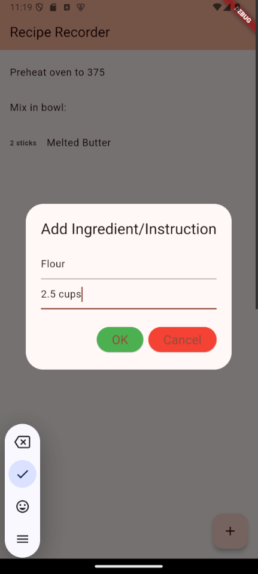
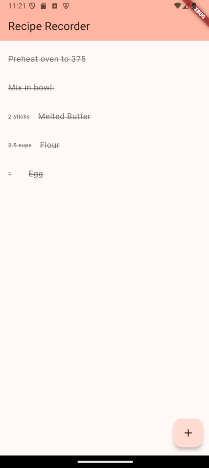
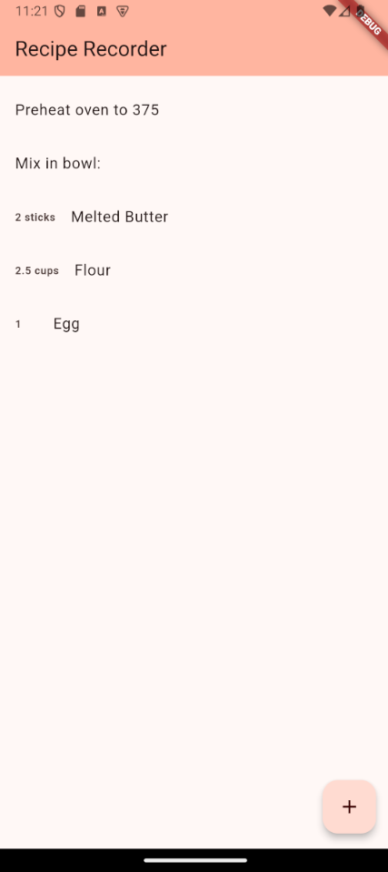

# Recipe Recorder

A simple flutter app that allows you to create a list of instructions and ingredients which make up a recipe, then track how far along you are in that recipe.

This is for all the cooks who value simplicity and a consistent routine: you can only create one recipe, and you have to recreate it each time you reopen the app.

## Usage

### Adding

To add an ingredient or instruction, click the plus icon in the bottom right corner.

To add an ingredient, fill in the top text field with the name of the ingredient and the bottom
text field with the amount, then press 'OK'.

To add an instruction, only fill in the top text field with the instruction text, then press 'OK'.

### Removing

To remove a step (a step is either an ingredient or an instruction),
hold down on the step until it disappears.

This is the only way to modify the steps you have already added, so be careful
to get the order right the first time!

### Tracking Progress

Tap on any step to mark it and all the steps up to it as complete.

To reset your progress (to mark every step as uncompleted), tap on the same step twice.

## Screenshots

